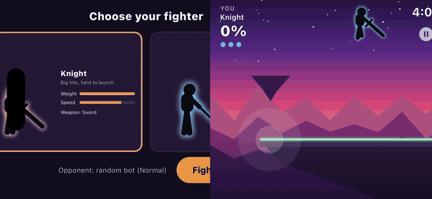
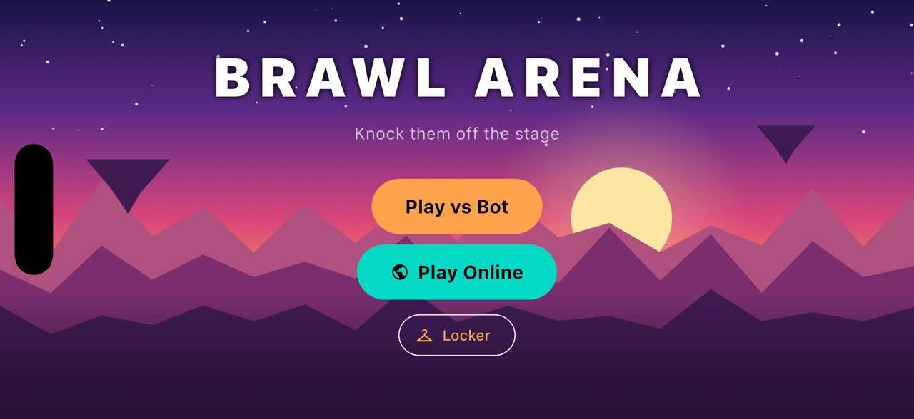
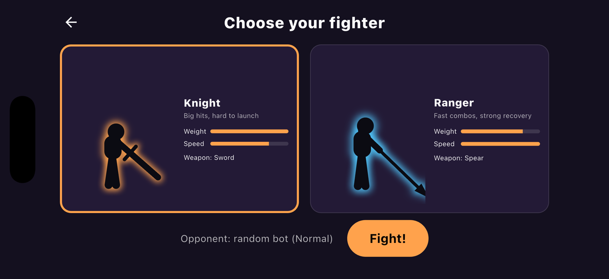
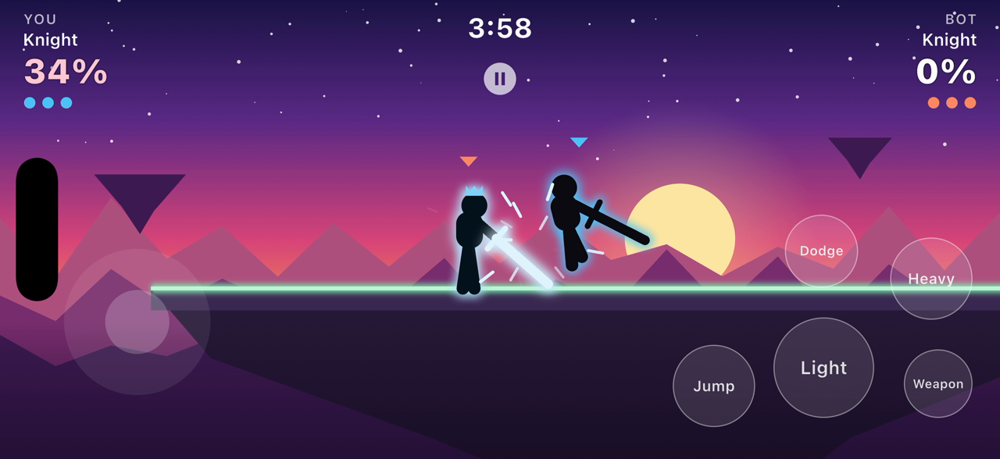
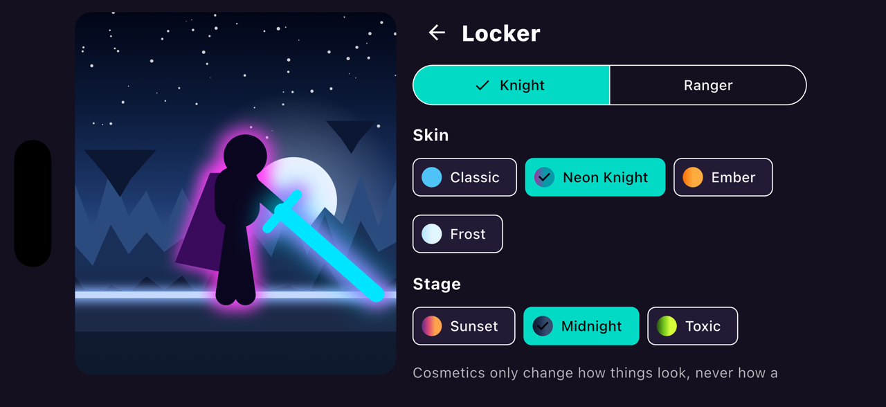
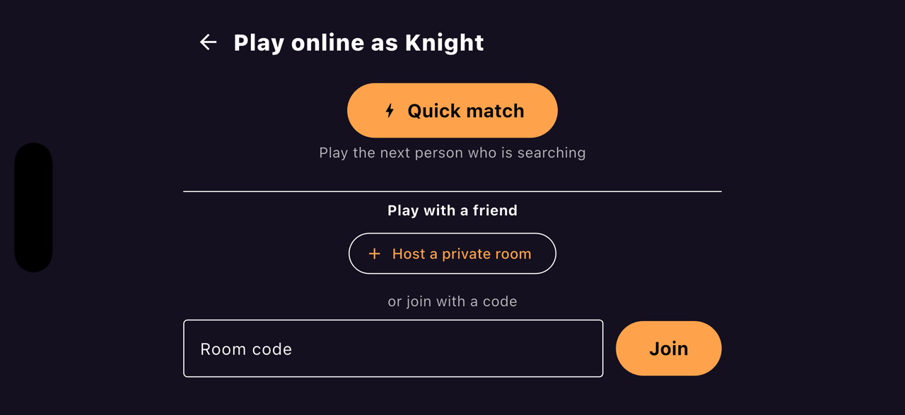

# Brawl Arena

A 2D platform fighter in the style of Brawlhalla, built with **Flutter** and
**Flame**. Knock your opponent off the floating stage: every hit raises their
damage %, and the higher it gets, the further they fly.

Play against a bot, or online against a friend or a random opponent, with
rollback netcode that keeps matches smooth even with lag.

**[▶ Play in the browser](https://dimas-ibnu.github.io/flutter_brawl_arena/)**



| | |
| --- | --- |
|  |  |
|  |  |
|  | |

## Features

- **Two fighters**, each with a weapon and 11 moves: light and heavy attacks
  in three directions, aerials, a recovery, a ground pound, and dodges.
  - **Knight**: heavy, slow, hits hard (sword).
  - **Ranger**: light, fast, long reach (spear).
- **Brawlhalla-style rules**: damage % and growing knockback, 3 stocks, a
  4-minute clock, hitstun, hit-freeze on strong hits, and a 1.5 s respawn at
  a random drop point so nobody can camp the spawn.
- **Bot opponent (Normal)** that reacts 0.25 s late like a human, dodges,
  guards the ledge, strings hits together and always makes it back to the
  stage.
- **Online play**
  - **Quick match**: get paired with whoever else is searching.
  - **Private rooms**: share a 5-letter code with a friend.
  - Peer to peer over WebRTC with **rollback netcode**: your inputs feel
    instant, and both players stay in sync (checked every second).
- **Cosmetics** defined in JSON, no image files: 8 skins (rim light, glowing
  weapons, trails, spark shapes, capes, horns, crowns, scarves) and 3 stage
  palettes. Visual only, never affecting match stats.
- **Runs on** Android, iOS, macOS and the web, with touch, keyboard and
  mouse controls.
- **Replays**: every match can be saved and replayed frame for frame.

## Controls

| Action | Keyboard | Touch |
| --- | --- | --- |
| Move | A / D | Stick (left half of the screen) |
| Jump (x3) | Space or W | Jump |
| Fast fall | S (in the air) | Stick down |
| Light attack | J | Light |
| Heavy attack | K | Heavy |
| Dodge | L | Dodge |
| Pause | Esc / P | Pause button |

Hold a direction while attacking or dodging to change the move (side light
lunges, down heavy sweeps both sides, heavy in the air is the recovery).
Debug keys: **F3** hitboxes and checksum, **F5** save a replay, **R** restart,
**T** switch the bot to a training dummy.

## Getting started

Requires Flutter 3.44+.

```bash
flutter pub get
```

Play against the bot (online play stays off without Firebase settings):

```bash
flutter run
```

With online play: copy the template, fill in your Firebase values, and run
with them. The full setup is in [README_ONLINE.md](README_ONLINE.md).

```bash
cp firebase.env.example.json firebase.env.json
```

```bash
flutter run --dart-define-from-file=firebase.env.json
```

`firebase.env.json` is git-ignored; CI reads the same JSON from the
`FIREBASE_ENV_JSON` repository secret.

## How it works

The match itself is a small, **deterministic** simulation in pure Dart: the
same seed and inputs always produce the same result, bit for bit, on every
platform (web included). That is what makes replays, the bot and rollback
netcode possible.

```
lib/
  sim/      Rules: fixed-point math, movement, attacks, knockback, stocks.
            No Flutter, no double, no platform-dependent integer tricks.
  ai/       The bot. Plays through the same inputs as a human.
  net/      Rollback session, packets, lobby handshake, quick-match queue,
            Firestore signaling, WebRTC transport.
  game/     Flame rendering: fighters, stage, sparks, camera, sound.
  ui/       Screens: title, fighter select, locker, online lobby, match.
  data/     Loaders for fighters.json and cosmetics.json.
  replay/   Record and replay input files.
assets/data/
  fighters.json     Every fighter stat and move: tune balance here.
  cosmetics.json    Skins and stage palettes.
```

Online flow: both players join a Firestore room (via quick match or a code),
swap WebRTC connection details, then play peer to peer. Each device runs the
full simulation, predicts the opponent's input, and rolls back up to 8 frames
when a prediction was wrong.

## Tests

```bash
flutter test
```

About 250 tests cover the rules, the bot, rollback under lag and packet loss
(including devices running at different speeds), matchmaking, replays, the
data files and the screens. The golden determinism test also runs compiled
to JavaScript, to prove web and native agree:

```bash
flutter test test/web --platform chrome
```

## Deploying the web version

[`.github/workflows/deploy-web.yml`](.github/workflows/deploy-web.yml) runs
on every push to `main`: tests, then a web build with the Firebase secret,
then GitHub Pages. In the repo settings, set **Pages → Source → GitHub
Actions**.

## Docs

- [README_ONLINE.md](README_ONLINE.md): Firebase and online setup.
- [firestore.rules](firestore.rules): database rules for rooms and the queue.
